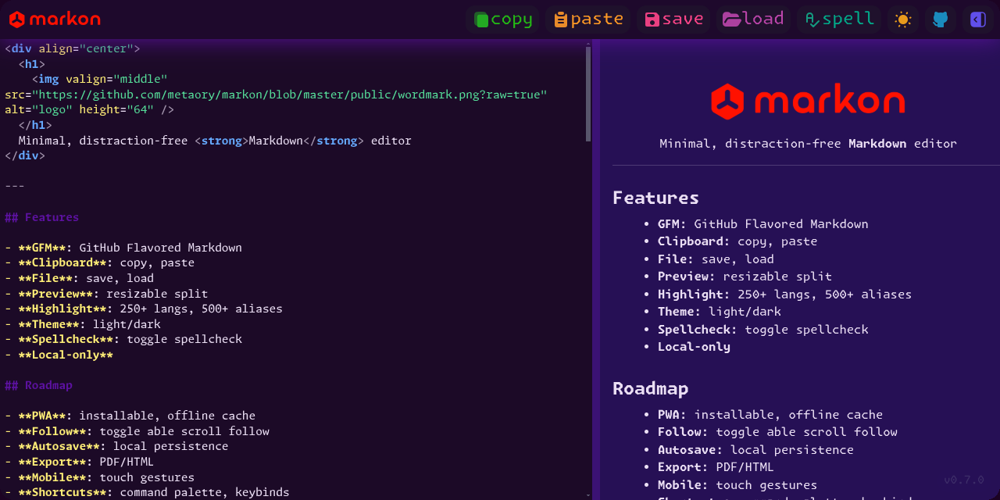

  <h1>
    
    markon
  </h1>
  <strong>
    Minimal Distraction‑free Markdown editor
  </strong>
   
  <h3>
    <a href="https://metaory.github.io/markon">metaory.github.io/markon</a>
  </h3>
   
  

---

## Features

- **Clipboard**: copy, paste
- **File**: save, load
- **Preview**: resizable split
- **GFM**: GitHub Flavored Markdown
- **Highlight**: 250+ langs, 500+ aliases
- **Theme**: light/dark
- **Spellcheck**: toggle spellcheck
- **Local‑only**

## Roadmap

- **PWA**: installable, offline cache
- **Autosave**: local persistence
- **Export**: PDF/HTML
- **Mobile**: touch gestures
- **Shortcuts**: command palette, keybinds
- **Theming**: custom CSS hook

---

## License

[MIT](LICENSE)

