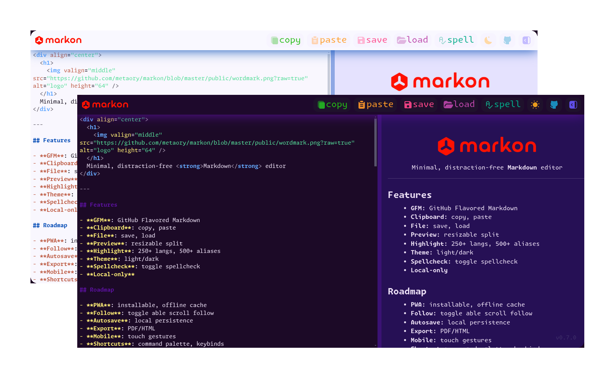

  <h1>
    
  </h1>
  <strong>
    Minimal Distraction‑free Markdown editor
  </strong>
   
  <h3>
    <a href="https://metaory.github.io/markon">metaory.github.io/markon</a>
  </h3>
  
  <h5>

> [!WARNING]
> Work in Progress 🚧

## Features

- **GFM**: GitHub Flavored Markdown
- **Clipboard**: copy, paste
- **File**: save, load
- **Preview**: resizable split
- **Highlight**: 250+ langs, 500+ aliases
- **Theme**: light/dark
- **Spellcheck**: toggle spellcheck
- **Local‑only**

## TODO

- add mobile support notice dialog
- fix keybinds
- fix scroll
- fix syntax highlighting for themes
- improve spec coverage

## Roadmap

- **Autosave**: local persistence
- **Export**: PDF/HTML
- **Mobile**: touch gestures
- **PWA**: installable, offline cache
- **Scroll**: toggle able scroll follow
- **Share**: url embedded hash content
- **Shortcuts**: command palette, keybinds
- **Theming**: custom CSS hook

> [!NOTE]
> _in no particular order_

---

## License

[MIT](LICENSE)

